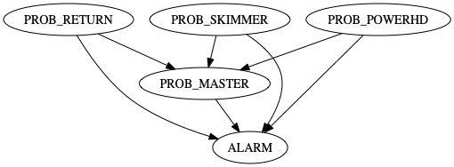

# Neptune Systems Apex Configuration

This repository serves as a backup of my Neptune Systems Apex AquaController.

The file for the configuration is available by telneting to port 23 on the AquaController,
logging in with your Apex local username/password and issuing a ```l``` command.

## Alarms

There are a set of alarms that are triggered for the Apex.  

### Problem Alarms

Problem alarms are virtual outlets that are triggered by the power draw for a component being greater than a particular value.  These are set via inspection of the power draw for the component plus a small margin.  The alarms feed into the PROB_MASTER output which also feeds into the ALARM.  An interesting side-effect is that components such as return pump or light that are drawing higher than their normal amount may indicative of the light being set incorrectly, potentially burning the coral.

| Name | Description | Power Limit |
|-|---|--|-------------------------
| PROB_RETURN | Problem with return pump | 18W |
| PROB_SKIMMER | Problem with Skimmer | 32W |
| PROB_MN_LT | Problem with Main Light | 55 W |
| PROB_POWERHD | Problem with Powerheads | 33W|


